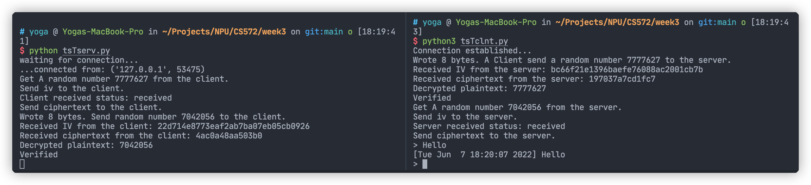

# CS572_Week3_HW1_19604_Yujia_Lin

GitHub: [https://github.com/blueandhack/Challenge-Response-Project](https://github.com/blueandhack/Challenge-Response-Project)

**Entity Authentication via Secret-Key Encryption**

```
Authenticate Bob to Alice
        Alice                                            Bob
choose    |                                               |
a random  |                                               |
numberr1 |                                               |
          |   Please encrypt this random numberr1        |
          |---------------------------------------------->|
          |                                               |
          |                                               | Encrypt
          |                                               |r1 using
          |                                               |KAB and chooses
          |                                               | a random
          |                                               | numberr2
          |    As you requested, here's c=EKAB(r1)         |
          |<----------------------------------------------|
          |  Also, please encrypt this random numberr2   |
Decrypt   |                                               |
usingKAB |                                               |
r1'=DKAB(c)|                                               |
r1' =r1? |                                               |
          |                                               |
          |                                               |
encryptr2|                                               |
usingKAB |                                               |
          |                                               |

Authenticate Alice to Bob
        Alice                                            Bob
          |                                               |
          |    As you requested, here's c=EKAB(r2)         |
          |---------------------------------------------->| Decrypt using
          |                                               |KAB
          |                                               |r2'=DKAB(c)
          |                                               |r2' =r2 ?
          |                                               |

```

Server:

```python
#!/usr/bin/env python

from random import randint
from socket import *
from time import ctime
import binascii
from Crypto.Cipher import AES
from Crypto.Util import Counter
from Crypto import Random

HOST = ''
PORT = 21567
BUFSIZ = 1024
ADDR = (HOST, PORT)

tcpSerSock = socket(AF_INET, SOCK_STREAM)
tcpSerSock.bind(ADDR)
tcpSerSock.listen(5)

key_bytes = 32

key = '12345678901234567890123456789012'

def decrypt(key, iv, ciphertext):
    assert len(key) == key_bytes

    # Initialize counter for decryption. iv should be
    # the same as the output of encrypt().
    iv_int = int(iv.hex(), 16)
    ctr = Counter.new(AES.block_size * 8, initial_value=iv_int)
    # iv = "0000000000000000".encode("utf-8")
    # Create AES-CTR cipher.
    aes = AES.new(key.encode('utf-8'), mode=AES.MODE_CTR, counter=ctr)

    # Decrypt and return the plaintext.
    plaintext = aes.decrypt(ciphertext)
    return plaintext

def encrypt(key, plaintext):
    assert len(key) == key_bytes

    # Choose a random, 16-byte IV.
    iv = Random.new().read(AES.block_size)

    # Convert the IV to a Python integer.
    iv_int = int(binascii.hexlify(iv), 16)

    # Create a new Counter object with IV = iv_int.
    ctr = Counter.new(AES.block_size * 8, initial_value=iv_int)

    # Create AES-CTR cipher.
    aes = AES.new(key.encode('utf-8'), mode=AES.MODE_CTR, counter=ctr)

    # Encrypt and return IV and ciphertext.
    ciphertext = aes.encrypt(plaintext.encode('utf-8'))
    return (iv, ciphertext)

while True:
    try:
        print('waiting for connection...')
        tcpCliSock, addr = tcpSerSock.accept()
        print('...connected from:', addr)

        data = tcpCliSock.recv(BUFSIZ)
        randomValue = int(data.decode('utf-8'))
        print("Get A random number " + str(randomValue) + " from the client.")
        temp = encrypt(key, str(randomValue))

        print("Send iv to the client.")
        tcpCliSock.send(temp[0])

        data = tcpCliSock.recv(BUFSIZ)
        print("Client received status: " + data.decode('utf-8'))

        print("Send ciphertext to the client.")
        tcpCliSock.send(temp[1])

        # generate random number and send to client
        randomValue = randint(1000000, 9999999)
        print("Wrote 8 bytes. Send random number " + str(randomValue) + " to the client.")
        tcpCliSock.send(str(randomValue).encode('utf-8'))

        iv = tcpCliSock.recv(BUFSIZ)
        print("Received IV from the client: " + str(binascii.hexlify(iv), 'ascii'))
        tcpCliSock.send("received".encode('utf-8'))
        ciphertext = tcpCliSock.recv(BUFSIZ)
        print("Received ciphertext from the client: " + str(binascii.hexlify(ciphertext), 'ascii'))
        plaintext = decrypt(key, iv, ciphertext)
        print("Decrypted plaintext: " + str(plaintext, 'ascii'))
        if str(randomValue) == str(plaintext, 'ascii'):
            print("Verified")

        while True:
            data = tcpCliSock.recv(BUFSIZ)
            # For example, if the client side
            # type Return without entering any
            # message to end communication.
            if not data:
                break
            timeWithData = "[" + ctime() + "] " + data.decode('utf-8')
            tcpCliSock.send(timeWithData.encode('utf-8'))

        # The client side ends communication
        tcpCliSock.close()
    except Exception as e:
        print(e)
        tcpCliSock.close()
        break
# The server side ends communication
tcpSerSock.close()
```

Client:

```python
#!/usr/bin/env python

from socket import *
from random import seed
from random import randint
import binascii
from tempfile import tempdir
from Crypto.Cipher import AES
from Crypto.Util import Counter
from Crypto import Random

HOST = 'localhost'
PORT = 21567
BUFSIZ = 1024
ADDR = (HOST, PORT)

tcpCliSock = socket(AF_INET, SOCK_STREAM)
tcpCliSock.connect(ADDR)

print("Connection established...")

seed(99)
randomValue = randint(1000000, 9999999)
print("Wrote 8 bytes. A Client send a random number " +
      str(randomValue) + " to the server.")
tcpCliSock.send(str(randomValue).encode('utf-8'))

key_bytes = 32

key = '12345678901234567890123456789012'

def decrypt(key, iv, ciphertext):
    assert len(key) == key_bytes

    # Initialize counter for decryption. iv should be
    # the same as the output of encrypt().
    iv_int = int(iv.hex(), 16)
    ctr = Counter.new(AES.block_size * 8, initial_value=iv_int)
    # iv = "0000000000000000".encode("utf-8")
    # Create AES-CTR cipher.
    aes = AES.new(key.encode('utf-8'), mode=AES.MODE_CTR, counter=ctr)

    # Decrypt and return the plaintext.
    plaintext = aes.decrypt(ciphertext)
    return plaintext

def encrypt(key, plaintext):
    assert len(key) == key_bytes

    # Choose a random, 16-byte IV.
    iv = Random.new().read(AES.block_size)

    # Convert the IV to a Python integer.
    iv_int = int(binascii.hexlify(iv), 16)

    # Create a new Counter object with IV = iv_int.
    ctr = Counter.new(AES.block_size * 8, initial_value=iv_int)

    # Create AES-CTR cipher.
    aes = AES.new(key.encode('utf-8'), mode=AES.MODE_CTR, counter=ctr)

    # Encrypt and return IV and ciphertext.
    ciphertext = aes.encrypt(plaintext.encode('utf-8'))
    return (iv, ciphertext)

iv = tcpCliSock.recv(BUFSIZ)
print("Received IV from the server: " + str(binascii.hexlify(iv), 'ascii'))
tcpCliSock.send("received".encode('utf-8'))
ciphertext = tcpCliSock.recv(BUFSIZ)
print("Received ciphertext from the server: " +
      str(binascii.hexlify(ciphertext), 'ascii'))
plaintext = decrypt(key, iv, ciphertext)
print("Decrypted plaintext: " + str(plaintext, 'ascii'))

# check random and plaintext
if randomValue == int(plaintext):
    print("Verified")

data = tcpCliSock.recv(BUFSIZ)
randomValue = int(data.decode('utf-8'))
print("Get A random number " + str(randomValue) + " from the server.")

temp = encrypt(key, str(randomValue))

print("Send iv to the server.")
tcpCliSock.send(temp[0])

data = tcpCliSock.recv(BUFSIZ)
print("Server received status: " + data.decode('utf-8'))

print("Send ciphertext to the server.")
tcpCliSock.send(temp[1])

while True:
    data = input('> ')
    # For example, if the server side
    # type Return without entering any
    # message to end communication.
    if not data:
        break
    tcpCliSock.send(data.encode('utf-8'))
    data = tcpCliSock.recv(BUFSIZ)
    if not data:
        break
    print(data.decode('utf-8'))

# The client side ends communication
tcpCliSock.close()
```

Screenshot:

